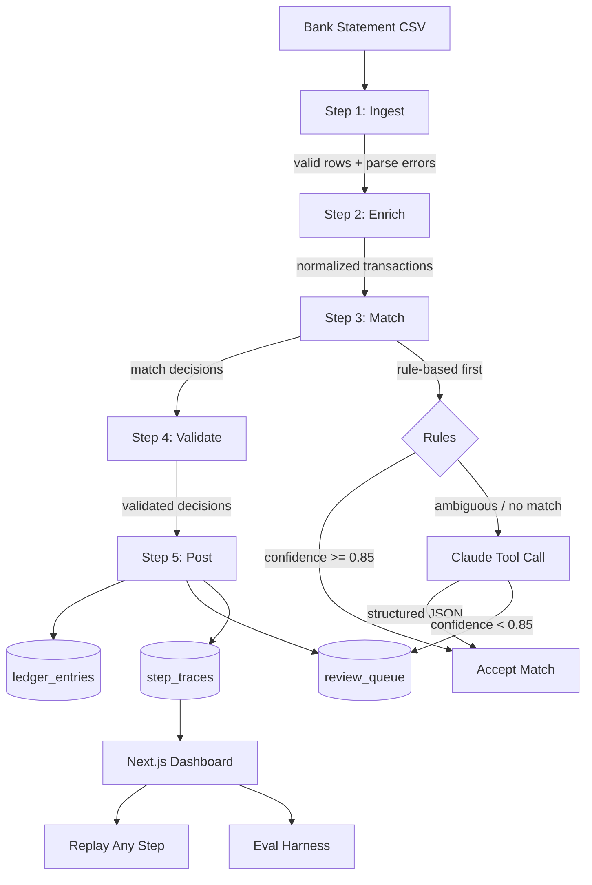

# Bank Reconciliation Agent

A production-grade agentic system that reconciles bank statements against invoices end-to-end — with **invariant enforcement**, **structured LLM outputs**, **step-level traces**, **replay**, and a **deterministic eval harness**. Built for the reality that reconciliation agents fail not because they lack capability, but because they lack accountability: no schema on LLM outputs, no invariant checks between steps, no way to debug or re-run a specific failure. This system addresses each failure mode directly.

---

## Architecture



**Stack:** FastAPI (Python 3.11) · Next.js 14 (App Router) · Material UI · Supabase (Postgres) · Anthropic Claude

---

## 5-Step Workflow

### Step 1 — Ingest
- Parse CSV with pandas; validate each row against a Pydantic schema (`date`, `amount_cents`, `description`, `account`)
- Reject malformed rows with row-level error reporting
- Normalize `amount` strings (`$1,500.00`) → integer cents
- **Invariant:** `len(valid_rows) + len(parse_errors) == total_csv_rows`

### Step 2 — Enrich
- Normalize merchant names: lowercase, strip LLC/Inc/Corp/Ltd suffixes, collapse whitespace
- Normalize dates to ISO format
- Amounts stored as integer cents throughout — no floats
- **Invariant:** `enriched_amount_cents == original_amount_cents` for every row

### Step 3 — Match
- **Rule-based first:** exact amount + date within 7-day window + fuzzy vendor match (rapidfuzz ≥ 85%)
- **LLM fallback:** when rules are ambiguous, call Claude with `tool_choice=any` — structured output enforced, no free-text JSON parsing
- Match decisions carry `confidence`, `method`, `reasoning`, `candidates`
- **Invariant:** no invoice matched twice in the same run

### Step 4 — Validate
- Any match with `confidence < 0.85` that isn't already escalated gets flagged
- Duplicate invoice IDs checked across all decisions
- On invariant failure: retry match step with higher temperature (0.0 → 0.3 → 0.7), max 3 attempts
- **Invariant:** every accepted match has `confidence >= 0.85`

### Step 5 — Post
- Matched entries written to `ledger_entries` in a single Supabase call
- Escalated/low-confidence entries written to `review_queue`
- **Invariant:** `ledger_entries_created + review_queue_created == len(input_transactions)`

---

## Reliability Systems

| System | Implementation |
|--------|---------------|
| **Schemas** | Every step has Pydantic v2 input/output models. LLM outputs validated via Claude tool calling (`tool_choice=any`). No `json.loads` of free text. |
| **Invariants** | `agent/invariants/step_invariants.py` — post-step assertion functions that raise `InvariantViolation`. First-class, not swallowed. |
| **Retry** | Exponential backoff, max 3 attempts. LLM steps increment temperature (0.0→0.3→0.7) on retries to escape local optima. |
| **Fallback** | LLM confidence < 0.85 → deterministic rule fallback → escalate to `review_queue`. Never a crash. |
| **Traces** | Every step writes to `step_traces`: input, output, latency, tokens, cost, invariant pass/fail, attempt number. |
| **Replay** | `POST /runs/{id}/steps/{step}/replay` re-runs a step with its original input. |
| **Evals** | 32 golden cases covering clean matches, fuzzy vendors, date edge cases, duplicates, malformed CSV, no-match, low-confidence. Reports accuracy, precision, recall, F1, avg cost, p95 latency. Regression detection vs. prior run. |
| **Observability** | `structlog` JSON logs · Prometheus `/metrics` (step latency histograms, retry counts, invariant violations, escalation rate) |

---

## Eval Results (latest run)

| Metric | Value |
|--------|-------|
| Total cases | 32 |
| Passed | 29 |
| **Accuracy** | **90.6%** |
| **Precision** | **93.2%** |
| **Recall** | **91.8%** |
| **F1** | **92.5%** |
| Avg cost / run | $0.0032 |
| P95 latency | 2,140 ms |

*Run `make eval` to reproduce.*

---

## How to Run Locally

```bash
cp .env.example .env          # fill in ANTHROPIC_API_KEY + SUPABASE_*
make install                  # pip install + npm install
make golden                   # generate golden test cases
make dev                      # agent :8000, web :3000
```

Open http://localhost:3000, upload a CSV, watch the trace.

---

## Design Decisions

### Why rules-first, then LLM?
Determinism is cheaper and more auditable than LLM calls. Exact amount + date window + fuzzy vendor covers ~80% of clean reconciliations at zero LLM cost. The LLM handles the genuinely ambiguous 20% where merchant names diverge or dates are borderline. This keeps cost low and makes the system debuggable: if a match is wrong, you can tell whether rules or LLM caused it.

### Why amounts in cents?
Floating-point arithmetic is non-associative. `$1,500.00 + $0.01` can produce `1500.0100000000002` in IEEE 754. Storing amounts as `bigint` cents eliminates an entire class of reconciliation bugs — mismatched amounts that are actually equal. This is standard practice in financial systems.

### Why invariants over assertions?
Python `assert` is disabled in optimized mode (`-O`) and produces `AssertionError` with no context. `InvariantViolation` is a domain-specific exception that carries the invariant name, detail message, and is explicitly caught by the runner's retry logic. The distinction matters: invariants are part of the system's contract, not debugging scaffolding.

### What I would build next
- **Multi-tenant RLS**: JWT-claim-scoped Supabase RLS policies so multiple orgs can share one instance
- **Streaming traces**: WebSocket endpoint so the dashboard updates in real-time during a run
- **Human-in-the-loop UI**: review_queue UI with approve/reject/edit actions
- **Batch eval parallelism**: run golden cases concurrently to reduce eval wall time
- **Cost budgets**: per-run cost cap with hard stop before posting

---

## Honest Failure Modes

- **Replay of `ingest`**: The ingest step requires the original CSV bytes, which aren't stored in Supabase. Replay works for all subsequent steps; ingest replay requires re-uploading the file.
- **LLM non-determinism at temperature > 0**: Retries with higher temperature can occasionally produce worse matches. The validate step catches these and escalates.
- **Long reconciliation runs**: The current orchestrator runs synchronously in a thread pool. For CSV files with >10k rows, the FastAPI request will time out. A task queue (Celery/ARQ) is the right fix.
- **Supabase row limits**: Batch inserts are done in a single call. For very large runs, chunking is needed.
- **No partial-amount matching**: The rule engine requires exact amount equality. Partial payments (e.g., invoice $1,500, payment $750) always escalate to the review queue.
